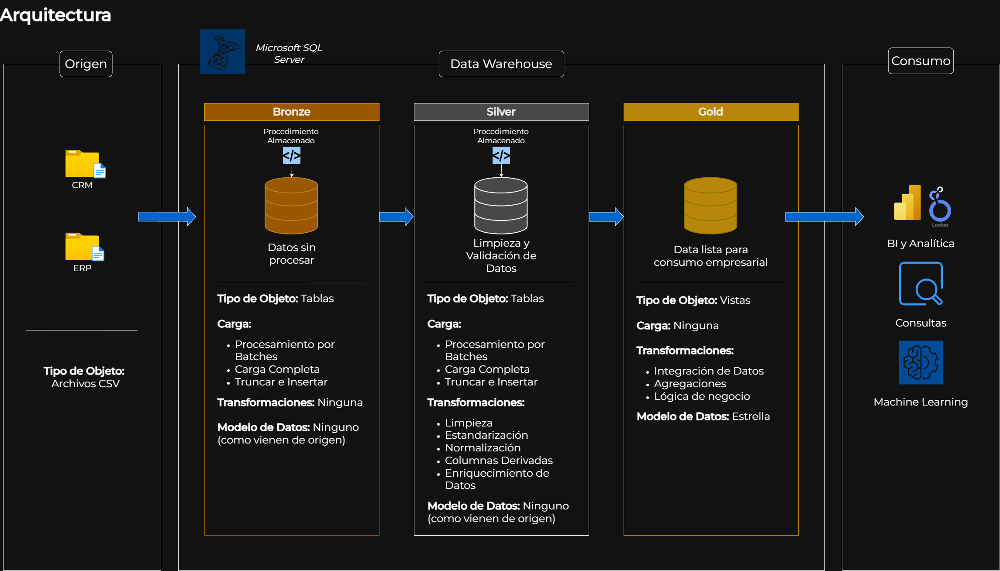
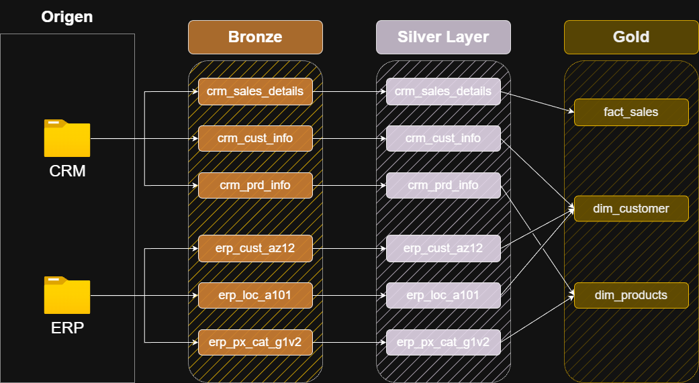
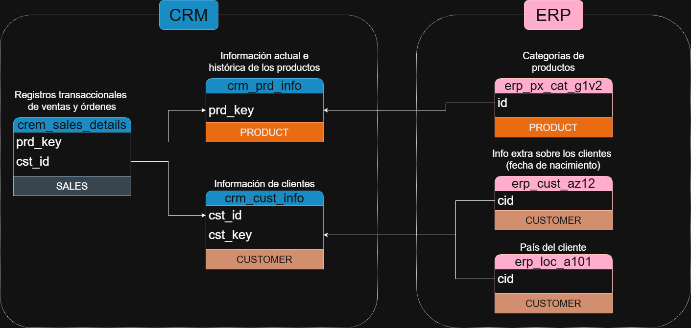
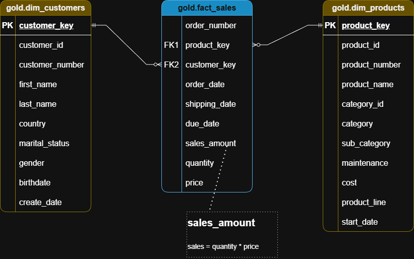

# Data Warehouse en SQL Server para Analítica de Negocio

## Descripción general

Este proyecto presenta una solución de _Data Warehousing_ en **Microsoft SQL Server**. Está diseñada para consolidar información de **ventas**, **productos** y **clientes** de un negocio de insumos para ciclismo. 
Los datos de origen provienen de sistemas CRM y ERP, inicialmente en formato CSV sin procesar y dispersos. La solución integra y transforma estos datos en un modelo centralizado, facilitando la generación de reportes, dashboards y análisis de negocio.

## Arquitectura de Datos

El proyecto aplica la [Arquitectura Medallion](https://learn.microsoft.com/en-us/azure/databricks/lakehouse/medallion), asegurando trazabilidad y consistencia mediante las capas **Bronze**, **Silver** y **Gold**.



1. **Capa Bronze**: Almacenamiento de datos en bruto tal como provienen de los sistemas de origen.
2. **Capa Silver**: Procesos de limpieza, estandarización y normalización de datos para análisis.
3. **Capa Gold**: Datos listos para el negocio, modelados en un esquema estrella para informes y analítica.

---

#### Especificaciones

* **Arquitectura de Datos**: Medallion (Bronze, Silver, Gold).
* **Pipelines ETL**: Extracción, transformación y carga desde sistemas de origen hacia el almacén.
* **Modelado de Datos**: Tablas de hechos y dimensiones optimizadas para consultas analíticas.
* **Analítica e Informes**: Habilita la creación de informes basados en SQL y tableros, para obtener información estratégica.

* **Origen de los Datos**: Dos sistemas (ERP y CRM) provistos como archivos CSV.
* **Calidad de los Datos**: Limpieza y resolución de problemas relacionados a la calidad de los datos.
* **Integración**: Unificación de ambas fuentes en un modelo de datos simple y eficiente, diseñado para realizar consultas analíticas.
* **Alcance**: Se trabaja con el dataset más actual, sin requerimientos de historización en esta etapa.
* **Documentación**: Catálogo y documentación clara del modelo de datos para analistas y _stakeholders_.

---

#### Técnicas y Métodos

**Extracción**:
* Método de Extracción: Pull Extraction
* Tipo de Extracción: Full Extraction
* Técnica de Extracción: File Parsing

**Transformaciones y Limpieza**:
* Eliminación de duplicados
* Filtrado de datos
* Gestión de valores nulos o inconsistentes
* Manejo de espacios no deseados
* Casteo de datos
* Detección de _outliers_
* Enriquecimiento e integración de datos
* Derivación de Columnas
* Normalización y Estandarización
* Reglas y lógica del negocio
* Agregaciones

**Carga**:
* Tipo de procesamiento: Batch Processing
* Método de Carga: Full Load (Truncate & Insert)
* Slowly Changing Dimensions: SCD 1 (Overwrite)

---
## Flujo de Datos



---
## Modelo de Integración



---
## Modelo Estrella (data mart)



---

## Implementación: de forma local o en servidor externo

1. Ejecutar _init_database.sql_ para crear la base de datos y los esquemas Bronze, Silver y Gold.
2. Ejecutar _ddl_bronze.sql_ para definir las tablas del esquema Bronze.
3. Ejectuar _proc_load_bronze.sql_ para crear el procedimiento que carga los datos en bruto desde los archivos _.csv_.
4. Ejectuar el procedimiento con EXECUTE proc_load_bronze para poblar el esquema Bronze.
5. Ejecutar _ddl_silver.sql_ para definir las tablas del esquema silver.
6. Ejectuar _proc_load_silver.sql_ para crear el procedimiento que carga los datos limpios y validados en el esquema Silver.
7. Ejecutar el procedimiento con EXECUTE proc_load_silver para poblar el esquema Silver.
8. Ejectuar _ddl_gold.sql_ para crear y cargar las vistas del esquema Gold.
9. Consultar directamente las tablas y vistas del esquema Gold.

---
## Estructura del Repositorio
```
sql-data-warehouse/
│
├── datasets/                           # Datasets en bruto (ERP y CRM)
│
├── docs/                               # Documentación del proyecto y detalles de su arquitectura
│   ├── data_architecture.png           # Diagrama de Arquitectura
│   ├── data_catalog.md                 # Catálogo del dataset
│   ├── data_flow.png                   # Diagrama de flujo de datos
│   ├── data_models.png                 # Diagrama del modelo de datos
│   ├── naming-conventions.md           # Convenciones de nombres
│
├── scripts/                            # Scripts SQL
│   ├── bronze/                         # Extracción y carga de datos en bruto  
│       ├── ddl_bronze.sql  
│       ├── proc_load_bronze.sql  
│   ├── silver/                         # Limpieza y transformación  
│       ├── ddl_silver.sql  
│       ├── proc_load_silver.sql  
│   ├── gold/                           # Modelo analítico  
│       ├── ddl_gold.sql  
│
├── tests/                              # Testing y control de calidad
│
├── README.md                           # Descripción del proyecto
└── LICENSE                             # Información sobre la licencia del repositorio
```

## Licencia
Este proyecto se encuentra bajo la licencia [MIT License](https://opensource.org/license/mit).

## Acerca de mí
Me llamo Cristian Añon. Soy Licenciado en Artes Electrónicas con amplia experiencia en el campo IT. Combino la rigurosidad técnica con el diseño, la creatividad y la comunicación.

[](https://linkedin.com/in/ceanon)
